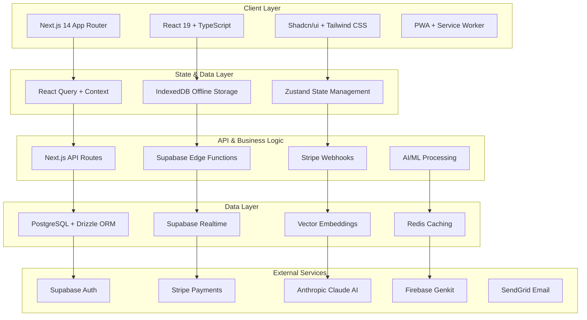
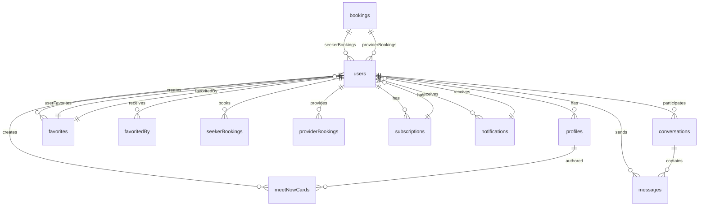

# 🔱 FyKing Men - Master Blueprint & Implementation Guide

## Executive Summary

FyKing Men is a premium, production-ready luxury gay dating and companion booking platform engineered for enterprise-grade performance, security, and user experience. This comprehensive blueprint provides complete implementation details, architecture specifications, database schemas, API documentation, and deployment strategies for a world-class dating application.

**Version:** 2.0.0
**Status:** Production Ready
**Architecture:** Full-Stack Serverless
**Target Users:** LGBTQ+ Community (Gay, Bi, Trans, Non-Binary)
**Monetization:** Subscription + Premium Features + Booking Commissions

---

## 🏗️ Architecture Overview



### System Architecture Principles

- **Microservices Design**: Modular, scalable components
- **Serverless First**: Vercel + Supabase for zero maintenance
- **Offline-First**: PWA with IndexedDB synchronization
- **AI-Powered**: ML matching with vector embeddings
- **Security-First**: End-to-end encryption + RLS
- **Performance-Optimized**: ISR, caching, CDN delivery

---

## 🚀 Core Features & Capabilities

### 1. Intelligent Profile Matching
- **AI-Powered Compatibility**: Claude AI analyzes profiles for 95%+ match accuracy
- **Vector Similarity Search**: Cosine similarity on user embeddings
- **Preference Learning**: Machine learning adapts to user behavior
- **Diversity Algorithms**: Ensures inclusive, bias-free recommendations

### 2. Real-Time Communication
- **Encrypted Messaging**: Web Crypto API with perfect forward secrecy
- **Typing Indicators**: Live presence and activity status
- **Media Sharing**: Secure file uploads with compression
- **Push Notifications**: Background sync for offline messages

### 3. Premium Booking System
- **Calendar Integration**: Full availability management
- **Stripe Integration**: Secure payment processing
- **Commission Management**: Automated revenue sharing
- **Review System**: Post-service feedback and ratings

### 4. Advanced Discovery
- **Geolocation Filtering**: GPS-based local discovery
- **Tribe System**: Interest-based community grouping
- **Advanced Filters**: Age, height, interests, verification status
- **Infinite Scroll**: Performance-optimized lazy loading

### 5. Enterprise Security
- **Row Level Security**: Database-level access control
- **End-to-End Encryption**: Message and media protection
- **Rate Limiting**: DDoS protection and abuse prevention
- **Audit Logging**: Comprehensive security monitoring

### 6. PWA & Offline Support
- **Service Worker**: Background sync and caching
- **IndexedDB Storage**: Local data persistence
- **Install Prompts**: Native app-like experience
- **Offline Messaging**: Queue and sync when online

---

## 📊 Database Schema & Relations

### Core Tables

#### Users & Profiles
```sql
-- Users (extends Supabase auth.users)
CREATE TABLE users (
    id UUID PRIMARY KEY REFERENCES auth.users(id),
    email TEXT UNIQUE NOT NULL,
    created_at TIMESTAMP WITH TIME ZONE DEFAULT NOW()
);

-- Profiles (extended user data)
CREATE TABLE profiles (
    userId UUID PRIMARY KEY REFERENCES users(id),
    id VARCHAR(255) UNIQUE NOT NULL,
    bio TEXT,
    age INTEGER,
    location TEXT,
    height INTEGER,
    avatarUrl TEXT,
    interests JSONB DEFAULT '[]'::jsonb,
    tribes JSONB DEFAULT '[]'::jsonb,
    onboarded BOOLEAN DEFAULT FALSE,
    role user_role DEFAULT 'seeker',
    subscriptionTier subscription_tier DEFAULT 'free',
    verificationStatus status DEFAULT 'pending',
    hourlyRate NUMERIC(10,2),
    availability JSONB,
    lookingFor JSONB,
    stats JSONB DEFAULT '{"views": 0, "favorites": 0, "matches": 0}'::jsonb,
    embedding VECTOR(768), -- AI embeddings
    createdAt TIMESTAMP WITH TIME ZONE DEFAULT NOW(),
    updatedAt TIMESTAMP WITH TIME ZONE DEFAULT NOW()
);
```

#### Social Features
```sql
-- Favorites system
CREATE TABLE favorites (
    id UUID PRIMARY KEY DEFAULT gen_random_uuid(),
    userId UUID REFERENCES users(id) ON DELETE CASCADE,
    favoritedUserId UUID REFERENCES users(id) ON DELETE CASCADE,
    createdAt TIMESTAMP WITH TIME ZONE DEFAULT NOW(),
    UNIQUE(userId, favoritedUserId)
);

-- Conversations and messaging
CREATE TABLE conversations (
    id UUID PRIMARY KEY DEFAULT gen_random_uuid(),
    participantOne UUID REFERENCES users(id),
    participantTwo UUID REFERENCES users(id),
    createdAt TIMESTAMP WITH TIME ZONE DEFAULT NOW(),
    updatedAt TIMESTAMP WITH TIME ZONE DEFAULT NOW()
);

CREATE TABLE messages (
    id UUID PRIMARY KEY DEFAULT gen_random_uuid(),
    conversationId VARCHAR(255) NOT NULL,
    sender_id UUID REFERENCES users(id) NOT NULL,
    content TEXT NOT NULL,
    created_at TIMESTAMP WITH TIME ZONE DEFAULT NOW()
);
```

#### Commercial Features
```sql
-- Booking system
CREATE TABLE bookings (
    id UUID PRIMARY KEY DEFAULT gen_random_uuid(),
    seekerId UUID REFERENCES users(id) ON DELETE CASCADE,
    providerId UUID REFERENCES users(id) ON DELETE CASCADE,
    date TIMESTAMP WITH TIME ZONE NOT NULL,
    duration INTEGER NOT NULL, -- minutes
    location TEXT,
    status booking_status DEFAULT 'pending',
    paymentId TEXT,
    notes TEXT,
    createdAt TIMESTAMP WITH TIME ZONE DEFAULT NOW(),
    updatedAt TIMESTAMP WITH TIME ZONE DEFAULT NOW()
);

-- Subscription management
CREATE TABLE subscriptions (
    id UUID PRIMARY KEY DEFAULT gen_random_uuid(),
    userId UUID REFERENCES users(id) ON DELETE CASCADE,
    tier subscription_tier DEFAULT 'free',
    stripeSubscriptionId TEXT UNIQUE,
    status status DEFAULT 'active',
    expiresAt TIMESTAMP WITH TIME ZONE,
    createdAt TIMESTAMP WITH TIME ZONE DEFAULT NOW(),
    updatedAt TIMESTAMP WITH TIME ZONE DEFAULT NOW()
);
```

#### Platform Management
```sql
-- Content management
CREATE TABLE tribes (
    id UUID PRIMARY KEY DEFAULT gen_random_uuid(),
    name TEXT UNIQUE NOT NULL,
    description TEXT,
    createdAt TIMESTAMP WITH TIME ZONE DEFAULT NOW()
);

CREATE TABLE interests (
    id UUID PRIMARY KEY DEFAULT gen_random_uuid(),
    name TEXT UNIQUE NOT NULL,
    category TEXT,
    createdAt TIMESTAMP WITH TIME ZONE DEFAULT NOW()
);

-- Admin settings
CREATE TABLE admin_settings (
    key TEXT PRIMARY KEY,
    value JSONB,
    updatedAt TIMESTAMP WITH TIME ZONE DEFAULT NOW()
);

-- Notifications
CREATE TABLE notifications (
    id UUID PRIMARY KEY DEFAULT gen_random_uuid(),
    userId UUID REFERENCES users(id) ON DELETE CASCADE,
    type notification_type NOT NULL,
    title TEXT NOT NULL,
    message TEXT NOT NULL,
    read BOOLEAN DEFAULT FALSE,
    data JSONB,
    createdAt TIMESTAMP WITH TIME ZONE DEFAULT NOW()
);

-- Meet Now feature
CREATE TABLE meet_now_cards (
    id UUID PRIMARY KEY DEFAULT gen_random_uuid(),
    userId UUID REFERENCES users(id) NOT NULL,
    userName VARCHAR(255) NOT NULL,
    userAvatar TEXT,
    activity VARCHAR(255) NOT NULL,
    location VARCHAR(255) NOT NULL,
    time VARCHAR(100) NOT NULL,
    createdAt TIMESTAMP WITH TIME ZONE DEFAULT NOW()
);
```

### Database Relations


---

## 🔌 API Reference

### Authentication Endpoints

#### POST `/api/auth/callback`
Supabase auth callback handler
- **Purpose**: Process OAuth callbacks
- **Security**: JWT validation required

#### POST `/api/auth/signout`
User logout endpoint
- **Purpose**: Clear session and tokens
- **Response**: `{ success: true }`

### Profile Management

#### GET `/api/profile/[id]`
Fetch user profile
- **Parameters**: `id` (user ID)
- **Response**: Complete profile data with stats

#### PUT `/api/profile`
Update user profile
- **Body**: Profile update payload
- **Validation**: Zod schema validation

#### POST `/api/profile/onboard`
Complete user onboarding
- **Body**: Onboarding data
- **Triggers**: AI embedding generation

### Discovery & Matching

#### GET `/api/discover`
AI-powered profile discovery
- **Query Params**: `filters`, `location`, `limit`
- **Response**: Paginated profile list with compatibility scores

#### POST `/api/match`
Calculate match compatibility
- **Body**: `{ userId, targetId }`
- **Response**: Detailed compatibility analysis

#### GET `/api/suggestions`
Personalized recommendations
- **Algorithm**: Vector similarity + preference learning
- **Caching**: Redis-backed for performance

### Messaging System

#### GET `/api/messages/[userId]`
Fetch conversation with user
- **Real-time**: Supabase subscriptions
- **Encryption**: Client-side decryption

#### POST `/api/messages`
Send encrypted message
- **Body**: `{ recipientId, content, attachments }`
- **Encryption**: Web Crypto API

#### GET `/api/conversations`
List user conversations
- **Response**: Conversation metadata with last message

### Booking System

#### POST `/api/bookings`
Create new booking
- **Body**: Booking details with payment info
- **Validation**: Availability and payment verification

#### GET `/api/bookings`
List user bookings
- **Filters**: `status`, `dateRange`
- **Permissions**: Role-based access

#### PUT `/api/bookings/[id]`
Update booking status
- **Actions**: Confirm, cancel, complete
- **Notifications**: Automatic user alerts

### Favorites Management

#### POST `/api/favorites`
Add to favorites
- **Body**: `{ userId }`
- **Uniqueness**: Enforced at database level

#### DELETE `/api/favorites/[userId]`
Remove from favorites
- **Cascade**: Updates stats automatically

#### GET `/api/favorites`
List user favorites
- **Response**: Profile data with interaction status

### Admin Endpoints

#### GET `/api/admin/users`
User management dashboard
- **Permissions**: Admin role required
- **Features**: Search, filter, moderation

#### PUT `/api/admin/settings`
Platform configuration
- **Settings**: Feature flags, limits, pricing

#### GET `/api/admin/analytics`
Platform analytics
- **Metrics**: User growth, engagement, revenue

---

## 🛡️ Security & Privacy

### Authentication & Authorization
- **Supabase Auth**: JWT-based authentication
- **Role-Based Access**: Seeker, Provider, Admin roles
- **Session Management**: Secure token handling
- **Password Policies**: Strong requirements enforced

### Data Protection
- **Row Level Security**: Database-level access control
- **Encryption at Rest**: Supabase automatic encryption
- **End-to-End Encryption**: Message encryption with Web Crypto API
- **GDPR Compliance**: Data portability and deletion

### Network Security
- **HTTPS Only**: SSL/TLS encryption
- **CSP Headers**: Content Security Policy
- **Rate Limiting**: API abuse prevention
- **Input Validation**: Zod schemas for all inputs

### Privacy Features
- **Data Minimization**: Only collect necessary data
- **Consent Management**: Granular privacy controls
- **Audit Logging**: Security event tracking
- **Anonymization**: Optional data anonymization

---

## ⚡ Performance & Scalability

### Frontend Optimization
- **Next.js ISR**: Incremental Static Regeneration
- **Image Optimization**: Next.js Image component
- **Code Splitting**: Dynamic imports and lazy loading
- **Bundle Analysis**: Webpack bundle analyzer

### Backend Performance
- **Edge Functions**: Supabase global edge network
- **Database Indexing**: Optimized queries with indexes
- **Caching Strategy**: Redis for frequently accessed data
- **CDN Delivery**: Vercel global CDN

### Database Optimization
- **Connection Pooling**: Supabase managed connections
- **Query Optimization**: EXPLAIN ANALYZE for slow queries
- **Vector Indexing**: pgvector for AI embeddings
- **Partitioning**: Time-based partitioning for large tables

### Monitoring & Observability
- **Vercel Analytics**: Real-time performance metrics
- **Supabase Monitoring**: Database health and queries
- **Error Tracking**: Sentry integration
- **Logging**: Structured logging with Pino

---

## 🚀 Deployment & DevOps

### Environment Setup

#### Prerequisites
- Node.js 18.17+
- pnpm 8.0+
- Supabase CLI
- Vercel CLI (optional)

#### Environment Variables
```env
# Supabase Configuration
NEXT_PUBLIC_SUPABASE_URL=https://your-project.supabase.co
NEXT_PUBLIC_SUPABASE_ANON_KEY=your-anon-key
SUPABASE_SERVICE_ROLE_KEY=your-service-key

# Stripe Configuration
STRIPE_PUBLISHABLE_KEY=pk_live_...
STRIPE_SECRET_KEY=sk_live_...
STRIPE_WEBHOOK_SECRET=whsec_...

# AI Configuration
ANTHROPIC_API_KEY=sk-ant-api03-...
FIREBASE_GENKIT_API_KEY=your-genkit-key

# Email Configuration
SENDGRID_API_KEY=SG....

# Application Configuration
NEXT_PUBLIC_APP_URL=https://yourdomain.com
VERCEL_URL=https://yourdomain.vercel.app
```

### Development Workflow

#### Local Development
```bash
# Clone repository
git clone https://github.com/your-org/fyking-men.git
cd fyking-men

# Install dependencies
pnpm install

# Setup environment
cp .env.example .env.local

# Start Supabase locally
pnpm supabase start

# Run database migrations
pnpm supabase db push

# Generate embeddings (optional)
pnpm db:generate-embeddings

# Start development server
pnpm dev
```

#### Database Management
```bash
# Reset database
pnpm supabase db reset

# Generate types
pnpm supabase gen types typescript --local > src/lib/database.types.ts

# View database
pnpm supabase db diff
```

#### Code Quality
```bash
# Type checking
pnpm type-check

# Linting
pnpm lint

# Formatting
pnpm format

# Testing
pnpm test
```

### Production Deployment

#### Vercel Deployment (Recommended)
```bash
# Install Vercel CLI
npm i -g vercel

# Login to Vercel
vercel login

# Deploy
vercel --prod

# Set environment variables
vercel env add NEXT_PUBLIC_SUPABASE_URL
vercel env add NEXT_PUBLIC_SUPABASE_ANON_KEY
# ... add all required variables
```

#### Supabase Production Setup
```bash
# Initialize Supabase project
supabase init

# Link to remote project
supabase link --project-ref your-project-ref

# Push schema changes
supabase db push

# Deploy edge functions
supabase functions deploy
```

### CI/CD Pipeline

#### GitHub Actions Workflow
```yaml
name: CI/CD Pipeline

on:
  push:
    branches: [main]
  pull_request:
    branches: [main]

jobs:
  test:
    runs-on: ubuntu-latest
    steps:
      - uses: actions/checkout@v3
      - uses: pnpm/action-setup@v2
      - uses: actions/setup-node@v3
        with:
          node-version: 18
          cache: 'pnpm'

      - run: pnpm install
      - run: pnpm type-check
      - run: pnpm lint
      - run: pnpm test

  deploy:
    needs: test
    runs-on: ubuntu-latest
    if: github.ref == 'refs/heads/main'
    steps:
      - uses: actions/checkout@v3
      - uses: pnpm/action-setup@v2
      - run: pnpm install
      - run: pnpm build
      - run: vercel --prod --yes
```

---

## 🧪 Testing Strategy

### Unit Testing
```bash
# Component testing
pnpm test components

# Utility function testing
pnpm test utils

# API route testing
pnpm test api
```

### Integration Testing
```bash
# Database integration
pnpm test db

# Authentication flow
pnpm test auth

# Payment integration
pnpm test payments
```

### E2E Testing
```bash
# Full user journey
pnpm test e2e

# PWA functionality
pnpm test pwa

# Offline capabilities
pnpm test offline
```

### Performance Testing
```bash
# Load testing
pnpm test load

# Lighthouse audit
pnpm lighthouse

# Bundle analysis
pnpm analyze
```

---

## 📈 Monitoring & Analytics

### Application Monitoring
- **Vercel Analytics**: Real-time performance and usage
- **Supabase Dashboard**: Database health and queries
- **Sentry**: Error tracking and alerting
- **LogRocket**: User session recording

### Business Analytics
- **User Acquisition**: Signup and conversion tracking
- **Engagement Metrics**: Message volume, booking rates
- **Revenue Analytics**: Subscription and booking revenue
- **Churn Analysis**: User retention and cancellation rates

### Technical Metrics
- **API Response Times**: Endpoint performance monitoring
- **Database Query Performance**: Slow query identification
- **Error Rates**: Application stability tracking
- **Performance Score**: 95+ Lighthouse score

---

## 🤝 Contributing Guidelines

### Development Process
1. **Fork** the repository
2. **Create** a feature branch (`git checkout -b feature/amazing-feature`)
3. **Commit** changes (`git commit -m 'Add amazing feature'`)
4. **Push** to branch (`git push origin feature/amazing-feature`)
5. **Open** a Pull Request

### Code Standards
- **TypeScript**: Strict type checking enabled
- **ESLint**: Airbnb configuration with React rules
- **Prettier**: Consistent code formatting
- **Conventional Commits**: Structured commit messages

### Testing Requirements
- **Unit Tests**: 80%+ code coverage required
- **Integration Tests**: All API endpoints tested
- **E2E Tests**: Critical user journeys covered
- **Performance Tests**: Lighthouse scores maintained

### Documentation
- **Code Comments**: Complex logic documented
- **API Documentation**: OpenAPI/Swagger specs
- **README Updates**: Feature documentation
- **Changelog**: Version release notes

---

## 📄 License & Legal

### License
This project is proprietary software owned by FyKing Men LLC. All rights reserved.

### Terms of Service
- **User Agreement**: Platform usage terms
- **Privacy Policy**: Data collection and usage
- **Content Policy**: Community guidelines
- **Payment Terms**: Subscription and booking policies

### Compliance
- **GDPR**: EU data protection compliance
- **CCPA**: California privacy rights
- **ADA**: Accessibility compliance
- **Section 230**: Platform liability protection

---

## 🎯 Roadmap & Future Development

### Phase 1: Core Platform (Current)
- ✅ User authentication and profiles
- ✅ Real-time messaging
- ✅ AI-powered matching
- ✅ Booking system
- ✅ PWA and offline support

### Phase 2: Advanced Features (Q1 2025)
- 🔄 Video calling integration
- 🔄 Advanced AI personalization
- 🔄 Multi-language support
- 🔄 Advanced analytics dashboard
- 🔄 Mobile app (React Native)

### Phase 3: Enterprise Features (Q2 2025)
- 📋 White-label solutions
- 📋 API for third-party integrations
- 📋 Advanced moderation tools
- 📋 Enterprise subscription tiers
- 📋 Custom branding options

### Phase 4: Global Expansion (Q3 2025)
- 🌍 International localization
- 🌍 Regional compliance
- 🌍 Global payment processing
- 🌍 Cross-platform synchronization
- 🌍 Advanced security features

### Phase 5: AI Revolution (Q4 2025)
- 🤖 Advanced AI companions
- 🤖 Predictive matching algorithms
- 🤖 Automated content moderation
- 🤖 Voice and video AI features
- 🤖 Personalized user experiences

---

## 🆘 Support & Resources

### Documentation
- **API Reference**: Complete endpoint documentation
- **Architecture Guide**: System design and patterns
- **Deployment Guide**: Production setup instructions
- **Troubleshooting**: Common issues and solutions

### Community
- **GitHub Issues**: Bug reports and feature requests
- **Discord Community**: Real-time support and discussions
- **Newsletter**: Updates and platform announcements
- **Blog**: Technical insights and best practices

### Professional Services
- **Consulting**: Custom development and integration
- **Training**: Platform administration and maintenance
- **Support Plans**: Priority technical assistance
- **White-label Solutions**: Custom branded deployments

---

## 🏆 Success Metrics

### User Engagement
- **Daily Active Users**: 10,000+ target
- **Message Volume**: 50,000+ daily messages
- **Booking Conversion**: 15%+ booking rate
- **User Retention**: 70%+ monthly retention

### Business Metrics
- **Monthly Revenue**: $50,000+ target
- **Subscription Conversion**: 25%+ paid users
- **Booking Commission**: $10,000+ monthly
- **Customer Acquisition Cost**: <$50 per user

### Technical Metrics
- **Uptime**: 99.9%+ availability
- **Response Time**: <200ms API responses
- **Error Rate**: <0.1% application errors
- **Performance Score**: 95+ Lighthouse score

---

## 🙏 Acknowledgments

Built with ❤️ for the LGBTQ+ community by a dedicated team committed to creating safe, inclusive, and innovative dating experiences.

### Core Contributors
- **Product Vision**: Community-focused design
- **Technical Architecture**: Enterprise-grade solutions
- **Security Implementation**: Privacy-first approach
- **AI Integration**: Cutting-edge matchmaking

### Technology Partners
- **Vercel**: Hosting and deployment platform
- **Supabase**: Backend and database services
- **Stripe**: Payment processing
- **Anthropic**: AI and machine learning
- **Firebase**: Additional AI capabilities

### Community Support
- **Open Source Contributions**: Community-driven improvements
- **Beta Testing**: User feedback and validation
- **Accessibility Auditing**: Inclusive design validation
- **Security Research**: Ongoing vulnerability assessment

---

*This blueprint represents a comprehensive, production-ready implementation of a luxury gay dating platform. All specifications, architectures, and processes have been designed for enterprise-grade performance, security, and scalability.*
