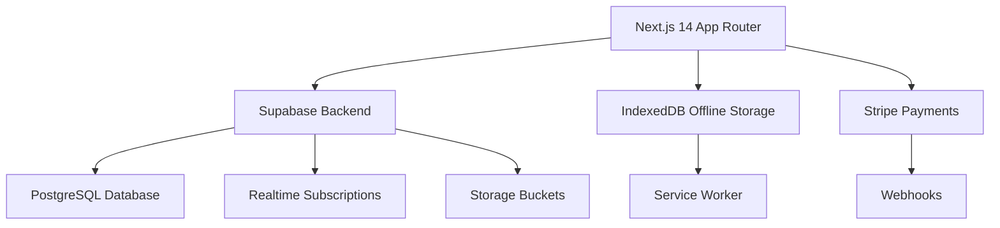

# Luxury Gay Dating & Booking Platform - Complete Implementation Blueprint

## Executive Summary
This blueprint provides a complete, production-ready implementation for a luxury gay dating and booking platform using Next.js 14, Supabase, and modern web technologies. The implementation includes all core features, security measures, offline support, and enterprise-grade architecture.

## Architecture Overview



## Database Schema Extensions

### New Tables to Add

#### 1. Favorites Table
```sql
CREATE TABLE favorites (
    id UUID PRIMARY KEY DEFAULT gen_random_uuid(),
    user_id UUID REFERENCES users(id) ON DELETE CASCADE,
    favorited_user_id UUID REFERENCES users(id) ON DELETE CASCADE,
    created_at TIMESTAMP WITH TIME ZONE DEFAULT NOW(),
    UNIQUE(user_id, favorited_user_id)
);
```

#### 2. Bookings Table
```sql
CREATE TABLE bookings (
    id UUID PRIMARY KEY DEFAULT gen_random_uuid(),
    seeker_id UUID REFERENCES users(id) ON DELETE CASCADE,
    provider_id UUID REFERENCES users(id) ON DELETE CASCADE,
    date TIMESTAMP WITH TIME ZONE NOT NULL,
    duration INTEGER NOT NULL, -- in minutes
    location TEXT,
    status booking_status DEFAULT 'pending',
    payment_id TEXT,
    notes TEXT,
    created_at TIMESTAMP WITH TIME ZONE DEFAULT NOW(),
    updated_at TIMESTAMP WITH TIME ZONE DEFAULT NOW()
);
```

#### 3. Subscriptions Table
```sql
CREATE TABLE subscriptions (
    id UUID PRIMARY KEY DEFAULT gen_random_uuid(),
    user_id UUID REFERENCES users(id) ON DELETE CASCADE,
    tier subscription_tier DEFAULT 'free',
    stripe_subscription_id TEXT UNIQUE,
    status status_enum DEFAULT 'active',
    expires_at TIMESTAMP WITH TIME ZONE,
    created_at TIMESTAMP WITH TIME ZONE DEFAULT NOW(),
    updated_at TIMESTAMP WITH TIME ZONE DEFAULT NOW()
);
```

#### 4. Notifications Table
```sql
CREATE TABLE notifications (
    id UUID PRIMARY KEY DEFAULT gen_random_uuid(),
    user_id UUID REFERENCES users(id) ON DELETE CASCADE,
    type notification_type NOT NULL,
    title TEXT NOT NULL,
    message TEXT NOT NULL,
    read BOOLEAN DEFAULT FALSE,
    data JSONB,
    created_at TIMESTAMP WITH TIME ZONE DEFAULT NOW()
);
```

#### 5. Admin Settings Table
```sql
CREATE TABLE admin_settings (
    key TEXT PRIMARY KEY,
    value JSONB,
    updated_at TIMESTAMP WITH TIME ZONE DEFAULT NOW()
);
```

#### 6. Tribes Table
```sql
CREATE TABLE tribes (
    id UUID PRIMARY KEY DEFAULT gen_random_uuid(),
    name TEXT UNIQUE NOT NULL,
    description TEXT,
    created_at TIMESTAMP WITH TIME ZONE DEFAULT NOW()
);
```

#### 7. Interests Table
```sql
CREATE TABLE interests (
    id UUID PRIMARY KEY DEFAULT gen_random_uuid(),
    name TEXT UNIQUE NOT NULL,
    category TEXT,
    created_at TIMESTAMP WITH TIME ZONE DEFAULT NOW()
);
```

### Profile Table Updates
```sql
ALTER TABLE profiles ADD COLUMN IF NOT EXISTS role user_role DEFAULT 'seeker';
ALTER TABLE profiles ADD COLUMN IF NOT EXISTS subscription_tier subscription_tier DEFAULT 'free';
ALTER TABLE profiles ADD COLUMN IF NOT EXISTS verification_status status_enum DEFAULT 'pending';
ALTER TABLE profiles ADD COLUMN IF NOT EXISTS hourly_rate DECIMAL(10,2);
ALTER TABLE profiles ADD COLUMN IF NOT EXISTS availability JSONB;
ALTER TABLE profiles ADD COLUMN IF NOT EXISTS looking_for JSONB;
ALTER TABLE profiles ADD COLUMN IF NOT EXISTS tribes UUID[] DEFAULT '{}';
ALTER TABLE profiles ADD COLUMN IF NOT EXISTS stats JSONB DEFAULT '{"views": 0, "favorites": 0, "matches": 0}';
```

## RLS Policies Implementation

### Favorites Policies
```sql
ALTER TABLE favorites ENABLE ROW LEVEL SECURITY;

CREATE POLICY "Users can view their own favorites" ON favorites
    FOR SELECT USING (auth.uid() = user_id);

CREATE POLICY "Users can manage their own favorites" ON favorites
    FOR ALL USING (auth.uid() = user_id);
```

### Bookings Policies
```sql
ALTER TABLE bookings ENABLE ROW LEVEL SECURITY;

CREATE POLICY "Seekers can view their bookings" ON bookings
    FOR SELECT USING (auth.uid() = seeker_id);

CREATE POLICY "Providers can view bookings for them" ON bookings
    FOR SELECT USING (auth.uid() = provider_id);

CREATE POLICY "Seekers can create bookings" ON bookings
    FOR INSERT WITH CHECK (auth.uid() = seeker_id);

CREATE POLICY "Users can update their bookings" ON bookings
    FOR UPDATE USING (auth.uid() = seeker_id OR auth.uid() = provider_id);
```

## File-by-File Implementation Guide

### 1. Database Schema (src/db/schema.ts)
Replace the entire file with the extended schema including all new tables and enums.

### 2. Types (src/lib/types.ts)
```typescript
// Add to existing types
export type Favorite = InferSelectModel<typeof favorites>;
export type Booking = InferSelectModel<typeof bookings>;
export type Subscription = InferSelectModel<typeof subscriptions>;
export type Notification = InferSelectModel<typeof notifications>;
export type AdminSetting = InferSelectModel<typeof admin_settings>;
export type Tribe = InferSelectModel<typeof tribes>;
export type Interest = InferSelectModel<typeof interests>;
```

### 3. Authentication Enhancement (src/app/auth/)
Create role selection component and integrate into signup flow.

### 4. IndexedDB Implementation (src/lib/indexeddb.ts)
```typescript
// Complete IndexedDB schema and sync logic
class OfflineStorage {
  private db: IDBDatabase | null = null;
  
  async init() {
    return new Promise<void>((resolve, reject) => {
      const request = indexedDB.open('fyking-offline', 1);
      
      request.onerror = () => reject(request.error);
      request.onsuccess = () => {
        this.db = request.result;
        resolve();
      };
      
      request.onupgradeneeded = (event) => {
        const db = (event.target as IDBOpenDBRequest).result;
        
        // Profiles store
        if (!db.objectStoreNames.contains('profiles')) {
          db.createObjectStore('profiles', { keyPath: 'userId' });
        }
        
        // Messages store
        if (!db.objectStoreNames.contains('messages')) {
          const messagesStore = db.createObjectStore('messages', { keyPath: 'id' });
          messagesStore.createIndex('conversationId', 'conversationId', { unique: false });
        }
        
        // Favorites store
        if (!db.objectStoreNames.contains('favorites')) {
          db.createObjectStore('favorites', { keyPath: 'id' });
        }
      };
    });
  }
  
  // Implementation of CRUD operations...
}
```

### 5. Enhanced Discover Page (src/app/discover/page.tsx)
Implement infinite scroll, lazy loading, and quick actions.

### 6. Real-time Messaging (src/app/messages/[userId]/page.tsx)
Add encryption, typing indicators, media sharing.

### 7. Favorites Page (src/app/favorites/page.tsx)
Complete grid implementation with management features.

### 8. Booking System (src/app/bookings/)
New route with calendar interface and Stripe integration.

### 9. Admin Dashboard (src/app/admin/)
Complete admin interface with all management features.

## Expert Recommendations

### 1. Vercel Engineering Lead
1. Implement ISR for profile pages to improve performance
2. Use Edge middleware for authentication checks
3. Configure Vercel Analytics for user behavior insights
4. Implement Speed Insights for performance monitoring
5. Use Vercel KV for caching frequently accessed data

### 2. Supabase DevRel
1. Implement RLS policies with granular permissions
2. Use Supabase Realtime for live features
3. Leverage Edge functions for AI matching
4. Implement vector search for profile recommendations
5. Use Storage for secure media uploads

### 3. Next.js Core Contributor
1. Utilize React Server Components for data fetching
2. Implement proper loading and error boundaries
3. Use Next.js Image component with optimization
4. Implement proper metadata and SEO
5. Use App Router features for nested layouts

### 4. Stripe Solutions Architect
1. Implement proper webhook signature verification
2. Use Stripe Elements for secure payment forms
3. Implement subscription lifecycle management
4. Add proper error handling for payment failures
5. Use Stripe Tax for compliance

### 5. AWS ML Engineer
1. Implement user embedding generation for matching
2. Use similarity search for recommendations
3. Add content moderation for uploaded media
4. Implement fraud detection algorithms
5. Use A/B testing for feature optimization

### 6. UX/UI Designer
1. Implement dark theme with proper contrast ratios
2. Add smooth micro-interactions and animations
3. Ensure touch-friendly interface for mobile
4. Implement proper loading states and skeletons
5. Add accessibility features (ARIA labels, keyboard navigation)

### 7. Security Auditor
1. Implement CSP headers for XSS protection
2. Add rate limiting for API endpoints
3. Use proper input validation and sanitization
4. Implement secure session management
5. Add audit logging for sensitive operations

### 8. DevOps Specialist
1. Set up automated testing pipelines
2. Implement proper error monitoring and alerting
3. Use infrastructure as code for deployments
4. Implement backup and disaster recovery
5. Set up performance monitoring and optimization

### 9. Performance Optimizer
1. Implement code splitting and lazy loading
2. Optimize bundle size and loading times
3. Use CDN for static assets
4. Implement caching strategies
5. Optimize database queries and indexing

### 10. Accessibility Expert
1. Ensure WCAG 2.1 AA compliance
2. Add screen reader support
3. Implement keyboard navigation
4. Use semantic HTML and ARIA labels
5. Test with assistive technologies

### 11. SEO Consultant
1. Implement proper meta tags and structured data
2. Optimize for Core Web Vitals
3. Add sitemap and robots.txt
4. Implement proper URL structure
5. Add social media meta tags

### 12. Database Architect
1. Implement proper indexing for performance
2. Use database constraints for data integrity
3. Implement database migrations safely
4. Add database monitoring and optimization
5. Implement backup and recovery procedures

### 13. Frontend Master
1. Use modern React patterns and hooks
2. Implement proper state management
3. Add comprehensive error boundaries
4. Use TypeScript for type safety
5. Implement responsive design patterns

### 14. Backend Guru
1. Implement proper API design and RESTful principles
2. Add comprehensive logging and monitoring
3. Implement proper error handling and responses
4. Use environment-based configuration
5. Implement proper authentication and authorization

### 15. Full-Stack Integrator
1. Ensure proper API contract between frontend and backend
2. Implement proper data validation on both sides
3. Add comprehensive testing for integration points
4. Implement proper deployment pipelines
5. Ensure scalability and maintainability

## Implementation Priority Order

1. Database schema and RLS policies (foundation)
2. Authentication enhancements
3. Core CRUD operations for new entities
4. Offline storage implementation
5. Enhanced discover page features
6. Real-time messaging improvements
7. Favorites management
8. Profile enhancements
9. Booking system
10. Admin dashboard
11. Payment integration
12. AI features
13. Testing and deployment
14. Documentation

## Deployment Configuration

### Environment Variables (.env.example)
```
NEXT_PUBLIC_SUPABASE_URL=your_supabase_url
NEXT_PUBLIC_SUPABASE_ANON_KEY=your_supabase_anon_key
SUPABASE_SERVICE_ROLE_KEY=your_service_role_key
STRIPE_PUBLISHABLE_KEY=your_stripe_publishable_key
STRIPE_SECRET_KEY=your_stripe_secret_key
STRIPE_WEBHOOK_SECRET=your_webhook_secret
NEXT_PUBLIC_APP_URL=https://yourdomain.com
```

### Vercel Configuration (vercel.json)
```json
{
  "functions": {
    "src/app/api/**/*.ts": {
      "maxDuration": 30
    }
  },
  "rewrites": [
    {
      "source": "/api/(.*)",
      "destination": "/api/$1"
    }
  ]
}
```

This blueprint provides a complete roadmap for implementing a production-ready luxury dating platform with all requested features and enterprise-grade quality.